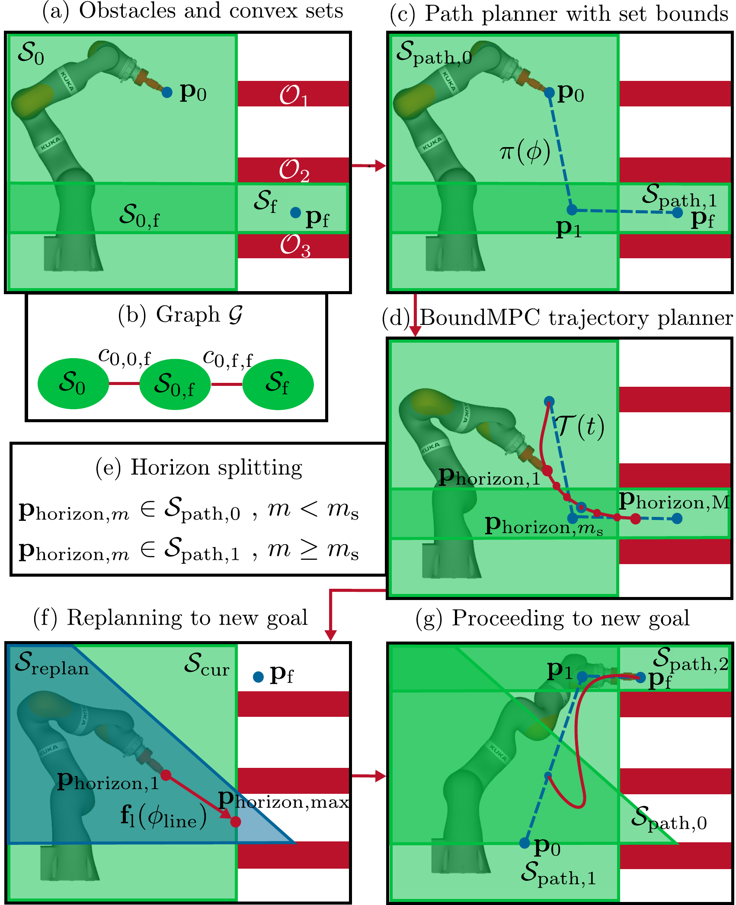

# BoundPlanner

Implementation of the [BoundPlanner ](https://arxiv.org/abs/2502.13286) in combination with [BoundMPC](https://journals.sagepub.com/doi/10.1177/02783649241309354).

The main branch deviates slightly from the implementation in the paper. For the paper experiments see the `paper` branch.

This repository includes a path planner called "BoundPlanner" that plans a path for a receeding horizon trajectory planner called "BoundMPC".



## Dependencies

The implementation uses [Casadi](https://web.casadi.org/) for the
automatic differentiation to provide the required analytical derivatives to the
[Ipopt](https://coin-or.github.io/Ipopt/) solver.

If you only want to run the path planner BoundPlanner, simply installing the requirements using

```
pip install -r requirements.txt
```

is enough.

### Generation of kinematic Casadi functions

For the robot model, [Pinocchio](https://stack-of-tasks.github.io/pinocchio/download.html) is used. The PyPi version (installed with the above command) of Pinocchio does include the Casadi interface. Thus, as of now, the Casadi functions for the kinematics are part of this repository. If you want to change the robot model, you have to install Pinocchio as explained on the website.

## Nix flake

We provide a nix flake for convenience which can creates an environment to run the experiments in.
The environment can be activated using

```
nix develop .
```

## Real-time performance

The experiments can be made faster by using the [HSL MA57
solver](https://www.hsl.rl.ac.uk/catalogue/hsl_ma57.html).
This solver is not open source and in the interest of providing runnable code to
everyone, we provide the implementation without using the HSL MA57 solver.

## Running the example experiments

In order to run the provided example for BoundPlanner without BoundMPC run

```
python boundplanner_example.py
```

or for BoundPlanner with BoundMPC run

```
python boundplanner_with_mpc_example.py
```

## Visualization in RViz

If you want to visualize the results in RViz a [ROS2 humble](https://docs.ros.org/en/humble/index.html) installation is needed.

Build the URDF file for RViz using

```
cd bound_planner/RobotModel
xacro iiwa14.urdf.xacro mesh_path:=$(pwd) > iiwa_rviz.urdf
```

Set the variable `USE_RVIZ` to `true` at the top of the example file `boundplanner_example.py` or `boundplanner_with_mpc_example.py`.

You can start the RViz config with
```
ros2 launch launch/rviz.launch.py
```
